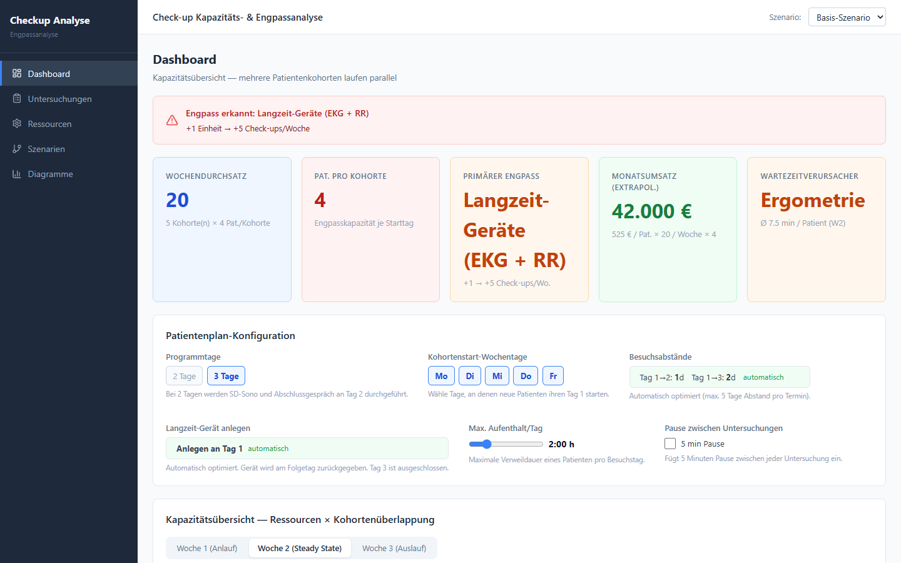
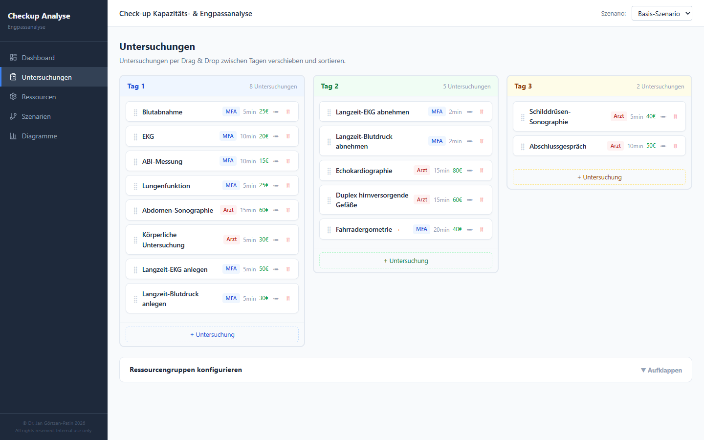
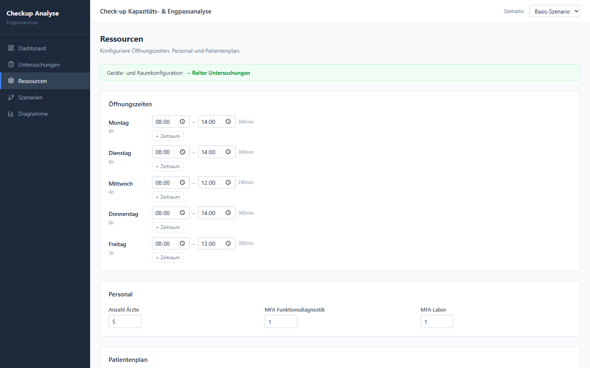
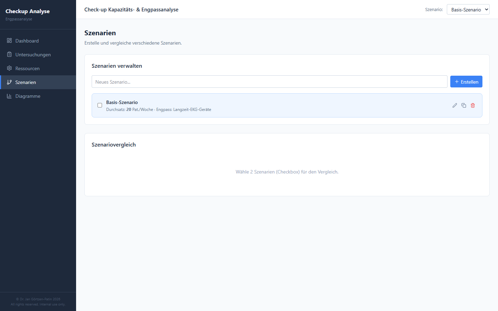
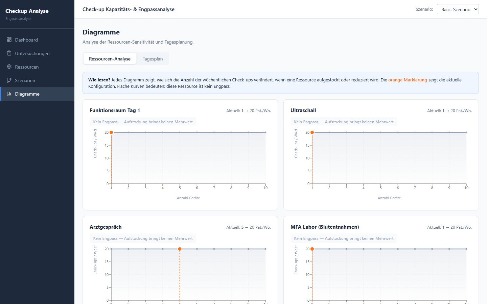
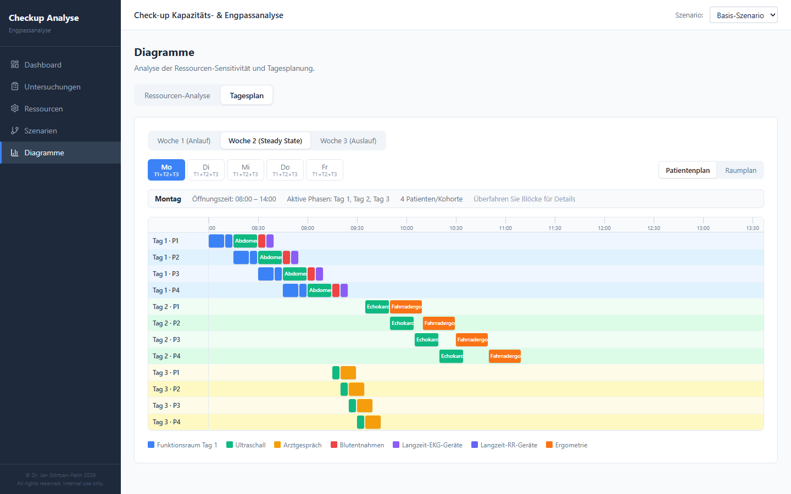

# Checkup-Engpassanalyse

Kapazitätsplanungstool für medizinische Vorsorgeuntersuchungen (Check-ups). Modelliert ein 3-Tage-Patientenprogramm mit überlappenden Kohorten, berechnet Ressourcenengpässe und visualisiert den Tagesablauf.

---

## Screenshots

### Dashboard — Kapazitätsübersicht



Das Dashboard zeigt die berechnete Wochenkapazität, den limitierenden Engpass, Umsatzschätzungen und die wichtigsten Steuerparameter auf einen Blick.

### Untersuchungen — Tagesplan-Editor


Alle Untersuchungen werden per Drag & Drop in drei Tages-Spalten (Tag 1 / Tag 2 / Tag 3) angeordnet. Neue Untersuchungen lassen sich direkt in der jeweiligen Spalte anlegen.



Jede Untersuchungskarte zeigt Dauer, Rolle, Beteiligungsquote (% der Patienten) und Umsatz. Aufgeklappt werden alle Parameter inline bearbeitet — inklusive Ressourcengruppe, Parallelisierung und Abhängigkeit zu einer Vorgängeruntersuchung.

### Ressourcen — Öffnungszeiten & Personal



Öffnungszeiten werden als echte Uhrzeiten (HH:MM) eingegeben. Pro Wochentag können mehrere Zeitintervalle definiert werden (z. B. 08:00–12:00 und 15:00–18:00). Zusätzlich werden Personalstärken und der Patientenplan konfiguriert.

### Szenarien — Vergleich mehrerer Konfigurationen



Beliebig viele Szenarien lassen sich anlegen, benennen und nebeneinander vergleichen. So können z. B. unterschiedliche Gerätezahlen oder Öffnungszeiten direkt gegenübergestellt werden.

### Diagramme — Sensitivitätsanalyse & Tagesplan



Die Sensitivitätsdiagramme zeigen, wie sich die Kapazität bei variierenden Gerätezahlen oder Personalstärken verändert.



Der Tagesplan-Tab visualisiert den geplanten Ablauf eines Besuchstages mit allen Untersuchungen und Patienten.

---

## Features

- **Drag & Drop Tagesplan**: Untersuchungen per Maus zwischen Tag 1 / 2 / 3 verschieben und innerhalb eines Tages sortieren (die Reihenfolge dient dem Scheduler als Tie-Breaker)
- **Vollständiges CRUD für Untersuchungen**: anlegen, bearbeiten, löschen; Parallelisierung („parallel mit“), Abhängigkeit („folgt nach“) und Ressourcengruppe pro Untersuchung
- **Patientenanteil pro Untersuchung**: einstellbar, bei wie viel Prozent der Patienten sie stattfindet (z. B. 60 % für LZ-EKG) (wirkt in Rechnung und Tagesplan)
- **Sonderverhalten per Datenfeld statt per Name**: „Gerätezyklus“ (anlegen/abnehmen bei Gerätegruppen), „Immer zuletzt“ und das bediende Personal je Personalgruppe sind in der UI einstellbar; Untersuchungen und Gruppen dürfen frei umbenannt werden
- **Flexible Öffnungszeiten**: mehrere Zeitintervalle pro Tag, Eingabe als HH:MM (Untersuchungen überspannen keine Schließzeit; der Tagesplan zeigt echte Uhrzeiten, siehe [Grenzen](docs/FUNKTIONSWEISE.md#8-bekannte-grenzen-und-fallstricke))
- **Gerätekonfiguration** im Reiter Untersuchungen: Geräte je Ressourcengruppe (Panel „Ressourcengruppen konfigurieren“) und **Geräte je Untersuchung** (Feld „Anzahl Geräte“ auf der Karte, z. B. 2 EKG-Geräte, 1 Lungenfunktionsgerät; leer = unbegrenzt). Personal im Reiter Ressourcen
- **Patientenplan**: Kohortenstart-Wochentage, 2- oder 3-Tage-Programm, maximale Verweildauer pro Besuchstag, optional 5 min Pause zwischen Untersuchungen
- **Umsatzoptimierung** (Menü „Optimierung“): schlägt vor, bei wie viel Prozent der Patienten jede Untersuchung stattfinden sollte, damit der Wochenumsatz unter den Kapazitäten maximal wird; mit Nachfrage-Obergrenze, Min./Max. je Untersuchung, Übernahme als neues Szenario (siehe [Funktionsweise](docs/FUNKTIONSWEISE.md#10-umsatzoptimierung))
- **Tagesgeschäft** (Menü „Tagesgeschäft“, an-/ausschaltbar): reguläre 15-Minuten-Patiententermine belegen Ärzte, MFA und Ultraschall (Minuten je Ressource einstellbar). Termine pro Wochentag, Schwankung in Prozent und Wert je Termin sind einstellbar. Die Seite zeigt die beste Zahl freizuhaltender Termine pro Tag und in einer Slot-Ansicht, wann und wo Kapazität für das Tagesgeschäft blockiert werden sollte (siehe [Funktionsweise](docs/FUNKTIONSWEISE.md#11-tagesgeschäft))
- **Automatische Optimierung**: Besuchsabstände (Tag 1→2, Tag 1→3) und der Tag zum Anlegen der Langzeitgeräte werden vom Rechner gewählt
- **3-Wochen-Kapazitätsmodell**: Woche 1 (Anlauf), Woche 2 (Steady State, bindend), Woche 3 (Auslauf)
- **Engpassanalyse per Sensitivität**: Für jede Ressource wird „+1 Einheit“ simuliert; alle mit Durchsatzgewinn gelten als Engpass
- **Kennzahlen**: Wochendurchsatz, Patienten pro Kohorte, extrapolierter Monatsumsatz, Wartezeitverursacher (Ø Wartezeit pro Patient)
- **Szenario-Vergleich**: mehrere Konfigurationen verwalten, zwei davon gegenüberstellen (Durchsatz, Umsatz, Wartezeit, Auslastung)
- **Diagramme**: Sensitivitätskurven je Ressource und Gantt-Tagesplan (Patienten- und Raumansicht)
- **Import / Export**: alle Szenarien als JSON sichern und wieder einspielen (ersetzt den kompletten Stand)
- **Live-Berechnung**: jede Parameteränderung löst sofort eine Neuberechnung aus

---

## Ressourcenmodell

| Typ | Formel | Beispiel |
|-----|--------|----------|
| `time_based` | `⌊Geräte × Öffnungsminuten / Gesamtbedarf pro Patient⌋` | Ultraschall, Ergometrie, Funktionsraum |
| `staff_multiplied` | `⌊Personal × Öffnungsminuten / Gesamtbedarf pro Patient⌋` | Arzt-Sprechzeit, MFA-Kapazität |
| `device_count` | `⌊Geräteanzahl / Beteiligungsquote⌋` | Langzeit-EKG, Langzeit-RR |

Die optimalen Besuchsabstände (Tag-2-Abstand, Tag-3-Abstand, LZ-Anlegen-Tag) werden automatisch berechnet — das System wählt die Kombination mit der höchsten Kapazität. Danach prüft ein Scheduler, ob der Tagesplan wirklich in die Öffnungszeiten passt, und senkt die Patientenzahl pro Kohorte bei Bedarf.

**Ausführliche Erklärung** (Modell, Formeln, Scheduler, Rechenbeispiel, bekannte Grenzen): [docs/FUNKTIONSWEISE.md](docs/FUNKTIONSWEISE.md)

---

## Architektur

```
defaultData.ts  →  appStore.ts  →  calculator.ts  →  UI-Komponenten
(Standarddaten)    (Zustand/immer)   (Kapazität)      (Dashboard, Diagramme, …)
                                  →  scheduler.ts
                                     (Tagesplanung)
```

- **State** lebt vollständig in `src/store/appStore.ts` (Zustand + immer, persistiert in `localStorage` unter `process-calc-v18`)
- **Jede Parameteränderung** löst sofort eine Neuberechnung aus (`calculateCapacity()`)
- **Keine Backend-Abhängigkeit** — läuft vollständig im Browser

### Verzeichnisstruktur

```
src/
  data/         # Standarddaten (Untersuchungen, Ressourcengruppen)
  lib/          # Kapazitätsrechner (calculator.ts), Scheduler (scheduler.ts), Umsatzoptimierer (optimizer.ts), Tagesgeschäft (dailyBusiness.ts), Datenmigration (normalize.ts)
  pages/        # Dashboard, Untersuchungen, Ressourcen, Szenarien, Diagramme, Import/Export
  components/   # Charts (Gantt, Sensitivität), Dashboard-Bausteine, Layout, Szenario-Vergleich
  store/        # Zustand-Store mit allen Aktionen
  types/        # TypeScript-Interfaces
docs/           # Funktionsweise (FUNKTIONSWEISE.md) und Screenshots
scripts/        # take-screenshots.mjs (Puppeteer, erzeugt docs/screenshots)
```

Der Router ist pfadbasiert (`/dashboard`, `/untersuchungen`, `/ressourcen`, `/szenarien`, `/diagramme`, `/optimierung`, `/tagesgeschaeft`, `/import-export`).

---

## Tech Stack

- **React 19** + TypeScript, **react-router-dom 7**
- **Zustand 5** (State Management mit immer + localStorage-Persistenz)
- **@dnd-kit/core + @dnd-kit/sortable** (Drag & Drop)
- **recharts** (Sensitivitätsdiagramme); der Gantt-Tagesplan ist eigener DOM-Code
- **Vite** + **Tailwind CSS v4** (Komponenten nutzen überwiegend Inline-Styles)

---

## Entwicklung

```bash
npm install
npm run dev        # Dev-Server auf http://localhost:5173
npm run build      # TypeScript-Check + Vite-Build
npm run preview    # Produktions-Build vorschauen
```

Hinweise: Es gibt keine automatisierten Tests; als Prüfung dienen `npm run lint` und `npx tsc -b`. Für neue Screenshots die App laufen lassen (Port 5173) und `node scripts/take-screenshots.mjs` ausführen.

---

## Hinweise

- Die App ist für den **internen Praxisbetrieb** konzipiert, nicht für den öffentlichen Einsatz.
- Alle Daten bleiben lokal im Browser (`localStorage`). Es werden keine Daten an externe Server übertragen. Sicherung und Übertragung auf einen anderen Rechner: Seite **Import / Export**.
- Beim ersten Start werden Standardwerte geladen (Basis-Szenario: 4 Patienten pro Kohorte, 20 Check-ups/Woche; Engpass sind die Langzeitgeräte).
- `Checkup_Engpassanalyse_einfach.xlsx` ist das ursprüngliche, einfache Excel-Modell (Slots pro Tag), aus dem die Standarddaten stammen. Die App ersetzt es; keine Code-Abhängigkeit.

---

© Dr. Jan Görtzen-Patin 2026. All rights reserved. Internal use only.
